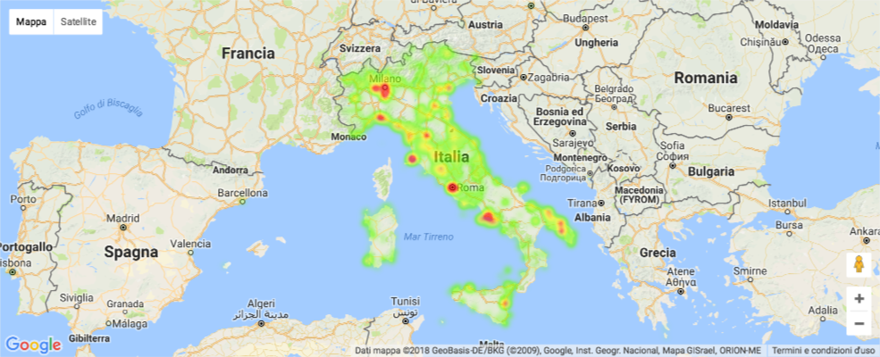
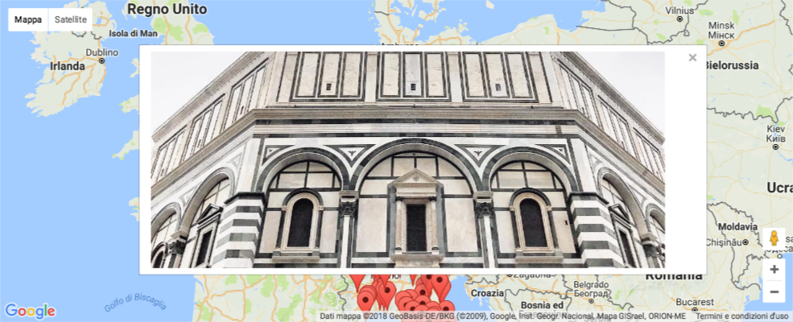

# Instagram Data Analysis

Some analysis and tests of instagram post scraped with [Instagram Scrapy Scraper](https://github.com/h4t0n/instagram-scraper).

I've used the following data analysis tools:
- Jupyter (with Python)
- Pandas
- Gmaps (Google Maps module for Jupyter)

### Hashtag
Take a look at [./gmaps_hashtag.ipynb](./gmaps_hashtag.ipynb) for all the steps.

#### Heatmap
From scraped post related to a single hashtag, I've extracted the post with a location set. Then using Google Masp I displayed a heatmap of all the post.

#### Markers with Post
The I filtered the posts of the last days and I displayed as a interactive Mark on Google Maps.

